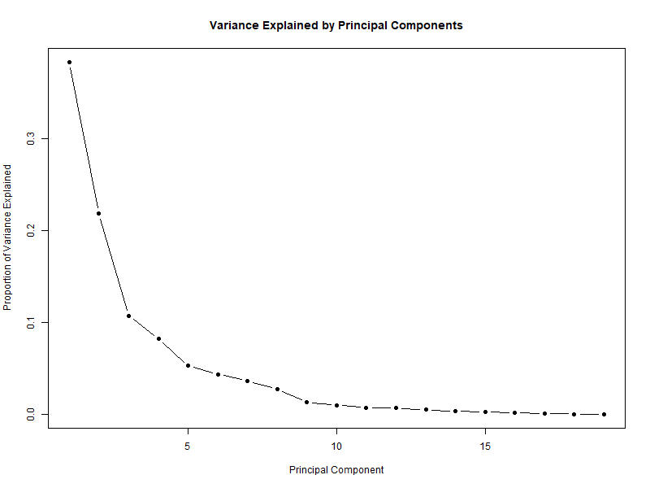
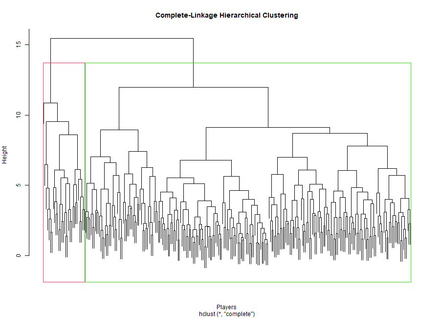
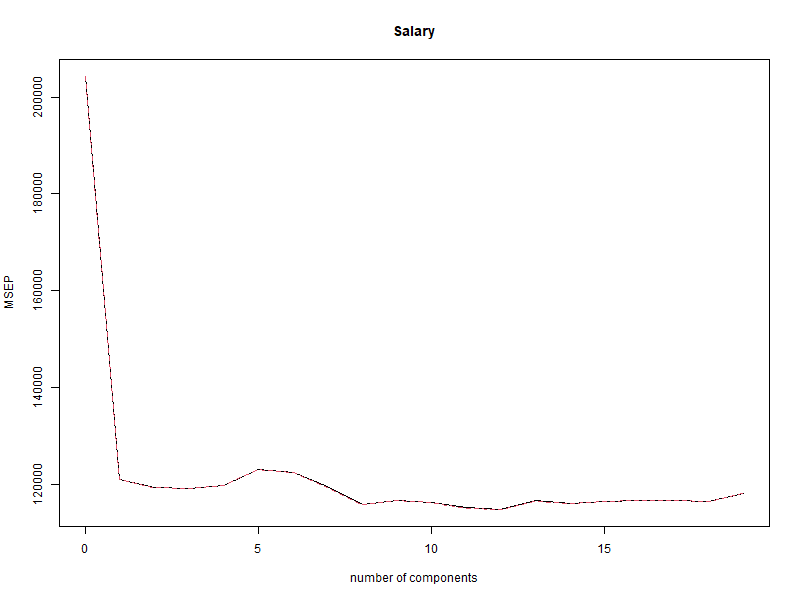

# Hitters-Data-Statistical-Machine-Learning-Analysis-R
Statistical learning analysis of the Hitters dataset using PCA, hierarchical and K-means clustering, and regression methods including linear regression, PCR, PLS, and ridge regression.

This project applies statistical and machine learning methods to the **Hitters dataset** using R. The analysis explores dimensionality reduction, clustering, and regression modeling of Major League Baseball player statistics.

## Dataset

The `Hitters` dataset from the **ISLR** package contains Major League Baseball player statistics and salary information.

After removing observations with missing salary values, **263 players** were included in the analysis.

---

## 1. Principal Component Analysis (PCA)

Principal Component Analysis was used to examine the structure of the predictor variables and reduce dimensionality.

The analysis included:

- Standardization of predictor variables
- Variance explained by principal components
- Interpretation of PC1 and PC2 using correlations and loadings
- PCA biplot for visualization

The first principal component explained approximately **38.31%** of the variance, while the first two components together explained approximately **60.16%**.

### PCA Visualization

---

## 2. Clustering Analysis

Two unsupervised clustering methods were used to identify groups of players with similar characteristics:

- Complete-linkage hierarchical clustering using Euclidean distance
- K-means clustering with K = 2

Hierarchical clustering produced clusters containing **233 and 30 players**, while K-means produced clusters containing **189 and 74 players**.

The clusters were compared using player characteristics and mean salary. Both methods identified a group of more experienced players with larger career statistics and higher average salaries.

### Hierarchical Clustering

---

## 3. Regression Modeling

Player `Salary` was modeled using four regression approaches:

- Multiple Linear Regression
- Principal Components Regression (PCR)
- Partial Least Squares (PLS)
- Ridge Regression

**Leave-One-Out Cross-Validation (LOOCV)** was used to estimate prediction error and select tuning parameters.

### Model Comparison

| Model | Selected Parameter | LOOCV MSE |
|---|---|---:|
| Multiple Linear Regression | All predictors | 118,039.7 |
| PCR | 16 PCs | 115,298.0 |
| **PLS** | **12 components** | **114,847.0** |
| Ridge Regression | λ = 25.53 | 115,547.4 |

PLS achieved the lowest LOOCV MSE among the four models, although PCR and ridge regression produced similar prediction performance.

### PLS Cross-Validation

---

## Key Findings

- PCA showed that a smaller set of principal components can summarize much of the variation in the player statistics.
- Hierarchical and K-means clustering identified meaningful groups based on player performance and career experience.
- Players in the more experienced clusters generally had higher average salaries.
- PCR, PLS, and ridge regression slightly improved prediction performance compared with multiple linear regression.
- **PLS produced the lowest LOOCV MSE of approximately 114,847.**

---

## Tools and Packages

- R
- R Markdown
- ISLR
- `pls`
- `glmnet`

---

## Project Files

- `01_Hitters_PCA_Analysis.Rmd` — Principal Component Analysis
- `02_Hitters_Clustering_Analysis.Rmd` — Hierarchical and K-means clustering
- `03_Hitters_Regression_Models.Rmd` — Linear regression, PCR, PLS, and ridge regression
- `Figures/` — Visualizations generated during the analyses

HTML versions of each analysis are also included for viewing the complete reports.
